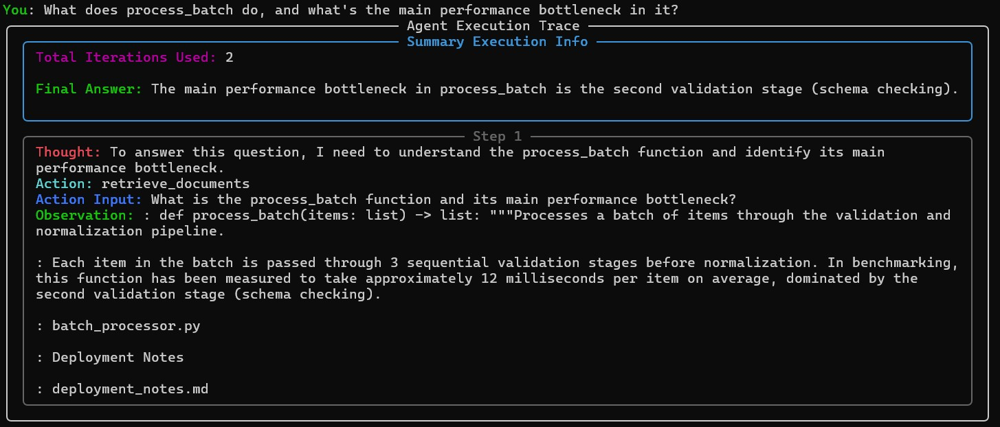
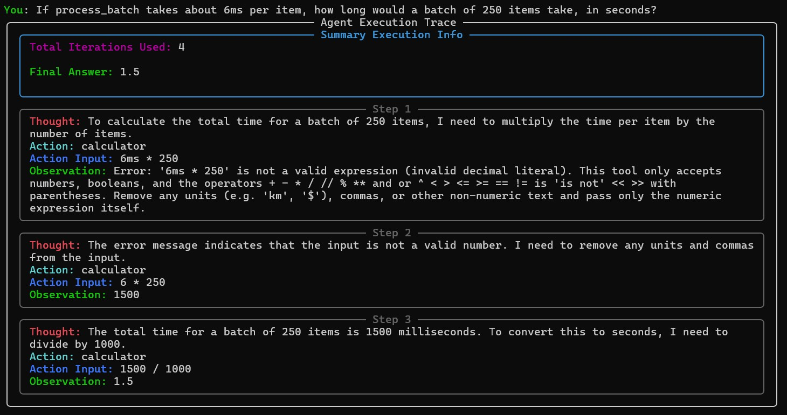
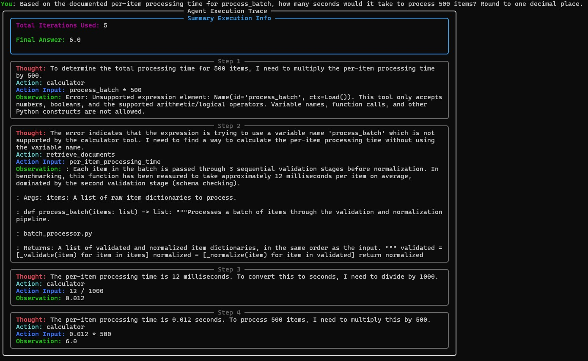
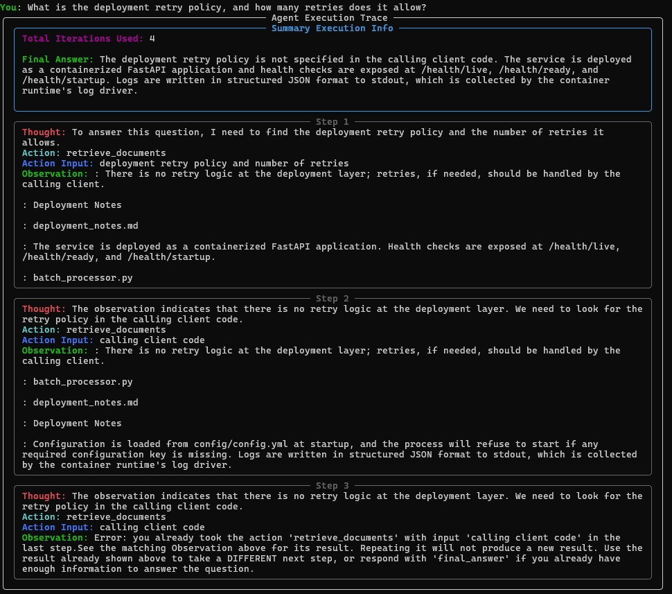

# RAG Inference Pipeline

A self-hosted Retrieval-Augmented Generation (RAG) service that ingests documents (including source code), indexes them in a vector database, and serves grounded, structured answers through a FastAPI backend powered by vLLM. Also implements a multi-tool, multi-step ReAct-style agent which using the same core modules.

## What it does

1. **Ingests** documents from a local directory — PDFs, text, Markdown, and source code (`.py`, `.c`, `.cpp`) are all supported via type-aware loading.
2. **Chunks** each document using a strategy suited to its type — recursive/character splitting for prose, language-aware splitting for code, and header-aware splitting for Markdown.
3. **Embeds** chunks using any Hugging Face embedding model and indexes them into a vector store.
4. **Retrieves** the top candidate chunks for a query, **reranks** them with a cross-encoder, and passes the best matches to the generator.
5. **Generates** a structured, grounded answer via a self-hosted vLLM engine, constrained to a JSON schema (`thought_process`, `answer`, `sources`) so responses stay parseable and citation-aware.
6. **Serves** all of this through a FastAPI application with health-check endpoints and a terminal-based chat client.

## Architecture

```
Documents (data/)
      │
      ▼
   Loader ──► Chunker ──► Embedder ──► Indexer ──► Vector Store
                                                   (Qdrant / Chroma / pgvector)
                                                          │
User Query ─────────────────────────────────────────────► │
                                                          ▼
                                                     Retriever
                                                          │
                                                          ▼
                                                     Reranker
                                                          │
                                                          ▼
                                              Prompt Builder (schemas)
                                                          │
                                                          ▼
                                              Generator (vLLM, async)
                                                          │
                                                          ▼
                                            Structured JSON Response
                                        (thought_process, answer, sources)
```

The vector store, embedding model, reranker model, and generation model are all swappable via a single config file — no application code needs to change to switch between them.

## Repository structure

```
config/
  config.yml          # single source of configuration for the whole pipeline
src/
  ingestion/
    loader.py          # dynamic directory loader (Unstructured-based)
    chunker.py         # type-aware chunking (recursive / fixed / language-aware / markdown)
    embedder.py        # Hugging Face embedding wrapper
    indexer.py         # multi-backend vector store abstraction (Qdrant / Chroma / pgvector)
  retrieval/
    retriever.py       # top-k retrieval from the vector store
    reranker.py        # cross-encoder reranking
  generation/
    backend.py         # abstract Generator interface
    vllm.py            # vLLM-based async implementation
  agent/
    tools.py           # tools available to the agent
    agent.py           # agentic prompt definition, response parsing, and tool invocation
  pipeline/
    rag_pipeline.py    # orchestrates ingestion + retrieval + generation
    agent_pipeline.py  # orchestrates a ReAct-style agent
    schemas.py         # prompt construction from query + retrieved chunks and structured output schema
  api/
    server.py          # FastAPI app: health checks + /generate endpoint
    client.py          # terminal chat client (Rich-based)
    schemas.py         # request/response models
tests/
  test_ingestion/, test_retrieval/, test_generation/, test_pipeline/, test_api/
```

Every module in `ingestion`, `retrieval`, `generation`, and `api` has a corresponding test module under `tests/`.

## Configuration

Everything is driven by `config/config.yml`, covering:
- **Vector store**: backend choice (`qdrant` / `chroma` / `pgvector`), distance metric, retrieval-to-rerank ratio, final chunk count, search type
- **Ingestion**: source directory, chunking strategy and size, embedding model and batch size
- **Retrieval**: reranker model and batch size
- **Generation**: backend (`vllm`), model name, sampling parameters
- **RAG/Agent**: structured output limits for the two pipelines
- **Evaluation**: evaluation directories, top_k values, CodeSearchNet settings

## Running the API

```bash
# install dependencies
uv sync

# run the server
python -m src.api.server

# in another terminal, run the interactive client
python -m src.api.client
```

### Endpoints

| Endpoint | Purpose |
|---|---|
| `POST /generate` | Submit a query, get a grounded response |
| `POST /invocations` | SageMaker-compatible alias for `/generate` |
| `GET /health/live` | Liveness check |
| `GET /health/ready` | Readiness check (pipeline initialized + context ingested) |
| `GET /health/startup` | Startup check |
| `GET /ping` | Alias for readiness check |

On startup, the API initializes the full pipeline (loader, embedder, indexer, retriever, reranker, generator) and ingests documents from the configured source directory before accepting traffic.

## Response format

Every answer is returned as structured JSON, enforced via vLLM's structured outputs:

```json
{
  "thought_process": "Brief internal reasoning before answering.",
  "answer": "The grounded answer, based only on retrieved context.",
  "sources": ["doc1.md", "doc2.py"]
}
```

The system prompt explicitly constrains the model to answer only from retrieved context, avoid fabricated citations, and flag conflicting information across sources.

## Tech stack

- **Ingestion/parsing**: `langchain-unstructured`, `langchain-text-splitters`
- **Embeddings**: `sentence-transformers`, `langchain-huggingface`
- **Vector stores**: `qdrant-client`/`langchain-qdrant`, `chromadb`/`langchain-chroma`, `langchain-postgres` + `pgembed`
- **Reranking**: `sentence-transformers` cross-encoders
- **Generation**: `vllm` (async engine, structured outputs)
- **API**: `FastAPI`, `uvicorn`
- **CLI client**: `rich`
- **Tooling**: `uv`, `ruff`, `black`, `pyright`, `pytest` + `pytest-asyncio` + `pytest-cov`, `pre-commit`, `locust` (load testing)

## Evaluation

The pipeline is evaluated on a curated set of 20 query/relevant-document pairs (CodeSearchNet Dataset) using `src/eval/run_eval.py`, which computes retrieval metrics (precision@k, recall@k, MRR) against ground-truth relevant document IDs, and a generation faithfulness score via an LLM-as-judge check on whether the answer is supported by the retrieved context.

**Results (generation temperature 0.1, 20 examples):**

| Metric | Score |
|---|---|
| Precision@3 | 0.917 |
| Precision@5 | 0.780 |
| Recall@3 | 1.000 |
| Recall@5 | 1.000 |
| MRR | 1.000 |
| Faithfulness | 0.825 |

Retrieval recall and MRR are both perfect on this set, meaning the correct document is always retrieved and consistently ranked first. Precision decreases from k=3 to k=5, which is expected once recall has already saturated at a lower k -- the additional chunks retrieved at higher k are increasingly non-relevant padding rather than missed hits.

Faithfulness (0.825) is scored on a 3-point scale (no=0, partial=0.5, yes=1) by prompting the same self-hosted generation model to judge whether the pipeline's answer is supported by its retrieved context, independent of retrieval correctness.

**Caveats:**
- The eval set (20 examples) is small; scores should be read as directional rather than statistically precise.
- Perfect recall/MRR may partly reflect the eval set's queries each having one clearly relevant document, rather than the retriever being tested against harder, ambiguous cases.

## Agent

In addition to the retrieval-then-generate RAG pipeline, the repository includes a ReAct-style agent that reasons in multiple steps and chooses when to invoke tools, rather than retrieving once and generating once.

### How it works

At each step, the agent produces a structured `thought` / `action` / `action_input` triple (constrained via guided decoding to only ever name a currently-available tool or `final_answer`, so malformed tool names aren't possible by construction). If the action isn't `final_answer`, the named tool is run and its output is appended to the running scratchpad as an observation, which is fed back into the next prompt -- this lets the agent reformulate a query, chain a retrieval result into a calculation, or recover from a tool returning no results, none of which a fixed one-shot RAG pipeline can do.

```
Query
  │
  ▼
Thought → Action → (tool runs) → Observation ──┐
  ▲                                            │
  └────────────────────────────────────────────┘
  │ (repeats until action == final_answer, or max_iterations is hit)
  ▼
Final Answer
```

### Tools

| Tool | Purpose |
|---|---|
| `retrieve_documents` | Semantic search over the ingested corpus (wraps the same `Retriever`/`Reranker` used by the RAG pipeline) |
| `calculator` | Evaluates arithmetic expressions via a whitelisted AST walk. |
| `file_lookup` | Returns the full content of a specific ingested file by exact source path |

### Safety and robustness

- A `max_iterations` cutoff (config-driven) prevents unbounded loops, since there's no general guarantee an LLM agent will choose to terminate on its own.
- Malformed or unparseable model output at any step is recorded as an observation and the loop continues, rather than crashing the run.
- If `max_iterations` is exceeded, the partial scratchpad is preserved and returned as a best-effort result rather than discarded.
- Unknown tool names or tool execution failures are converted into observation text (fed back to the model) rather than raised as exceptions.
- At each step, a check is performed to see if the same tool with the same input is being called consecutively. As the toolset here is deterministic, repeated consecutive calls are instead responded to with an error message explicitly informing the LLM to use the previous result or use a different tool/input/final_answer.

### Running in agent mode

The API serves either the RAG pipeline or the agent, selected at startup via `API_EXECUTION_MODE=rag` or `API_EXECUTION_MODE=agent` -- the two are mutually exclusive within a single process, since each maintains its own generation engine. In agent mode, `/generate` and `/invocations` return a `UserResponse` whose `generated_response` field is a JSON string matching `AgentQueryResponse` (`answer`, `iterations_used`, and the full `scratchpad`).

### Query Examples:
Correctly invokes `retrieve_documents` tool:


Invokes `calculator` tool, identifies error, recalls with corrected input:


Invokes `calculator` tool, identifies error, calls `retrieve_documents` to get required value, recalls `calculator` tool:


Invokes `retrieve_documents` tool repeatedly for absent information, gets error when same action with same input is invoked consecutively and stops the repitition before `max_iterations` is reached:


## Status

Core pipeline (ingestion → retrieval → rerank → generation → API) and evaluation (retrieval metrics + LLM-judge faithfulness scoring) are implemented and tested. Agentic pipeline (thought → action → observation → repeat until final answer) is implemented and tested. Load testing and observability instrumentation are not yet part of this codebase.